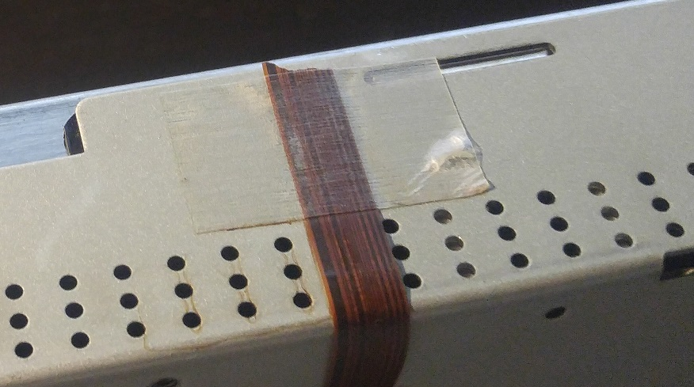
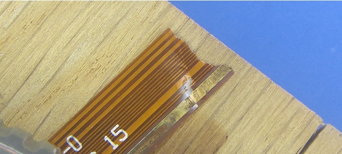

# Fix NEC LCD 2190Uxp front panel

## About the project

Long story short ([this comment does it great](https://www.amazon.com/review/R8F81CR5VWF1F)): when your monitor front cracks, it's likely the main ribbon cable for main control will be completely torn due. Bad design, but also NEC does not provides this ribbon cable *(including controls as they are soldered on the ribbon cable)* ... oh no.

This could have been avoid with less adhesive neer the frontier or the chassis / plastic.



A torn ribbon is very, very unlikely to be repaired. You can find some videos ([this for instance](https://www.youtube.com/watch?v=TwvelNOHioY)) with rare guys succeeding in this process with microscope / micro-soldering skills / and a lot of time.



But let's be realistic, and provide an easy project to understand and provide a workaround. We will:
- Reverse engineering and understand the main connector pins
- Build a new hacky additional controller

This controller is not that trivial in this monitor, by order of importance we will:
1. **Add new external buttons** (power, source, arrows, rotate, exit) and make the monitor functional
2. **Add LED support** (green/blue?)
3. **Add Light sensor** if we can (not sure I will ever without help)


## Reverse engineering of the controller cable
The ribbon cable has **15 pins**. The biggest lane you can see on the photo is the main power lane used for buttons and to power other micro components (light sensor).


### Mapping of the ribbon lanes
- `VVVVVVVV` Input voltage (for buttons)
- `...` Unkown (LED, light sensor)
- Buttons (narrow lane )
  - `|` separator
  - `P` Power button
  - `I` Input
  - `E` Exit
  - `←` Left button
  - `→` Right button
  - `↑` Up button
  - `↓` Down button
  - `R` Reset/Rotate


```python  
|| .a. || .b. || .c. || ↓ | → || ← | E | ↑ | I | R || .... || P | . ||| VVVVVVVV ||
   _↑______↑_____↑_                                    _↑_________↑_
  |poss. light sens|                                  | poss. LED   |
  |on 3 bits       |                                  | + blue/green|
```

There are still 5 unknown lanes, more likely 3 bits encoding light level (8 levels of light), the big lane for the LED input voltage, and a last bit to choose between LED color.

### Mapping of the ribbon connector
15 pins view from front:
```perl
    V-V . P . R I ↑ E ← → ↓ . . .
    | | | | | | | | | | | | | | |
 ___                              ___
|     connector shown from front     |
----|                            |---
```

The ribbon cable has 0.5mm pitch. The connector has 1.0mm pitch.
That's why the connector is distributed left/right like this.
```python
      .a. -
      .c. -  - .b.
3       → -  - ↓
0       E -  - ←
1       I -  - ↑
S     ... -  - R
        . -  - P     <-- For instance if short those lanes
        V ---- V     <-|   you will power-up/down your monitor
```


## Building a new controller from scratch
Done soon I hope
